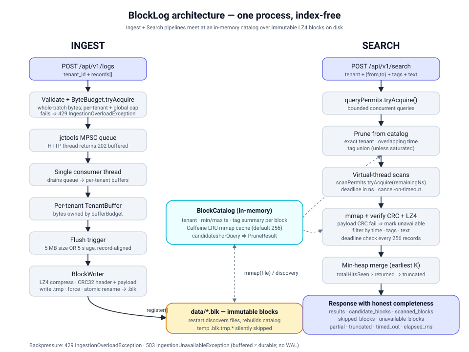

# BlockLog

[](https://github.com/shreemangalam/blocklog/actions/workflows/ci.yml)
&nbsp;
&nbsp;
&nbsp;

**A log storage engine that skips the index.** Records land in LZ4-compressed immutable blocks on disk. Searches prune over 90% of blocks using a small in-memory catalog before reading a single byte, then scan the survivors in parallel using Java virtual threads with nanosecond deadlines. Every response names exactly what it saw — candidate blocks, scanned blocks, blocks that failed CRC verification, and whether the result is partial.

Single-node prototype. Not a production database.



---

## The design decision

Most log search tools build an inverted index: every word in every message maps back to the records containing it. That generalises well when you don't know what you'll query. Incident response is the opposite — you already know the tenant, you know roughly when the event happened, and you have a tag or a keyword. The index is overhead you're paying to not use.

BlockLog skips it. A small in-memory catalog holds one entry per block: tenant ID, time range, and a tag summary. A query prunes candidates in microseconds, then fires one virtual thread per surviving block. Scans run concurrently with a shared deadline. If the deadline expires mid-scan, the partial result is labelled partial — it is never presented as a complete zero-match answer.

The second principle is honesty. Most systems return results and stay silent about what they skipped. BlockLog reports everything on every response: `candidate_blocks`, `scanned_blocks`, `unavailable_blocks`, `partial`, `truncated`, `timed_out`, `elapsed_ms`. A corrupted block is surfaced and counted, not silently dropped.

---

## Numbers

Measured on a single Windows laptop, all traffic on localhost. Same seeds reproduce the same records byte-for-byte.
Full commands and interpretation in [`docs/public/testing-evidence.md`](docs/public/testing-evidence.md).

| Metric | Result |
|---|---|
| Ingestion throughput | **31,210 records/sec** — single client thread, batch size 100 |
| Compression ratio | **3.86x** on realistic synthetic microservice logs |
| Search p95 | **75 ms** client-side / **74 ms** engine-only across 300 queries |
| Search p99 | 81 ms / 79 ms |
| Memory (idle to loaded) | 28 MB heap → 143 MB under 100k record ingest |
| JMH codec throughput | **31.7M decode ops/sec** at 64 bytes, 0 tags |
| Test suite | **37 tests** passing — round-trip codec, restart discovery, corruption injection, mmap eviction, deadline enforcement, concurrent writers, cross-tenant isolation, error surface |

---

## How it works

**Ingest:** HTTP request validates fields and checks per-tenant byte budget (429 if exhausted). Accepted records go onto a jctools MPSC queue — the HTTP thread returns `202 Buffered` immediately. A single consumer drains the queue into per-tenant in-memory buffers. A flush trigger fires at 5 MB or 5 seconds, whichever comes first: LZ4 compress, CRC32 header and payload, write to `.blk.tmp`, fsync, atomic rename to `.blk`, register in catalog. `202` means in memory, not on disk. A crash before the next flush loses those records.

**Search:** Catalog prune narrows candidates by exact tenant, overlapping time range, and tag union. Each surviving block gets one virtual thread. The thread mmaps the file, verifies the payload CRC (marks the block unavailable on failure), decompresses with LZ4, and filters records by time, tags, and text substring — checking the deadline every 256 records. Results merge through a min-heap for earliest-K ordering. The response always includes completeness metadata.

**Frontend:** Next.js App Router with a structured search form, a natural-language search tab (translates plain English to the structured query schema; requires an API key, gracefully inert without one), a live engine status page, an operator reference at `/help`, and a guided walkthrough at `/onboarding`.

---

## Quick start

Requires JDK 21 (Temurin) and Node 20+.

```bash
# Terminal 1 — backend API on :8080
cd backend && ./mvnw -q spring-boot:run

# Terminal 2 — frontend on :3000
cd frontend && npm ci && npm run dev

# Terminal 3 — seed a demo tenant
cd backend
java -cp target/classes com.blocklog.demo.SyntheticIngest --tenant demo-shop --count 1000
```

Open `http://localhost:3000`, set tenant to `demo-shop`, pick any UTC time range, and search. `/status` shows live counters. `/help` explains every response field. `/onboarding` walks through ingest, flush, and search with the actual request and response bodies shown inline.

---

## Demo: corruption becomes visibility, not silence

The most interesting thing to run. Flip one byte inside a block's compressed payload, restart the backend, and search across that time range. The engine detects the CRC failure at read time and reports the block as unavailable — it does not crash, does not silently exclude it, and does not pretend the result is complete.

```bash
# 1. Seed data and wait ~5 seconds for the flush trigger
cd backend
java -cp target/classes com.blocklog.demo.SyntheticIngest --tenant demo-shop --count 500

# 2. Flip one byte in a block's payload
ls data/*.blk
java -cp target/classes com.blocklog.demo.CorruptBlock --file data/<uuid>.blk

# 3. Restart the backend so the catalog rebuilds from disk
./mvnw -q spring-boot:run

# 4. Search across the corrupted block's time range
curl -s -X POST http://localhost:8080/api/v1/search \
  -H 'Content-Type: application/json' \
  -d '{"tenant_id":"demo-shop","from":"2020-01-01T00:00:00Z","to":"2030-01-01T00:00:00Z","limit":10,"timeout_ms":5000}' \
  | jq '{partial, unavailable_blocks, scanned_blocks, candidate_blocks}'
```

```json
{
  "partial": true,
  "unavailable_blocks": 1,
  "scanned_blocks": 0,
  "candidate_blocks": 1
}
```

The block passed header CRC at startup so it was counted as a candidate. The payload CRC failed on the first read so it was marked unavailable immediately. Results from any healthy blocks in the same query still come back normally.

---

## Tech stack

**Backend** — Java 21, virtual threads (Project Loom), Spring Boot 3.4, `java.nio`, lz4-java, jctools MPSC queue, Caffeine bounded mmap cache, Micrometer + Prometheus metrics. JUnit 5, JMH.

**Frontend** — Next.js 16 App Router, TypeScript, Tailwind CSS, shadcn/ui. Strict light theme throughout.

---

## What this deliberately isn't

- **No write-ahead log.** `202 Buffered` is an in-memory acknowledgement. A crash between acceptance and flush loses queued records.
- **No authentication.** `tenant_id` is client-supplied. A production deployment needs an enforcement layer in front of the ingest endpoint.
- **No distributed anything.** Single writer, single node, no replication.
- **No full-text search, no ranking, no fuzzy matching, no regex.** Case-sensitive substring only.
- **Numbers are from one laptop.** All measurements are localhost; network latency would dominate the ~74 ms engine time.

---

## License

[LICENSE](LICENSE)
